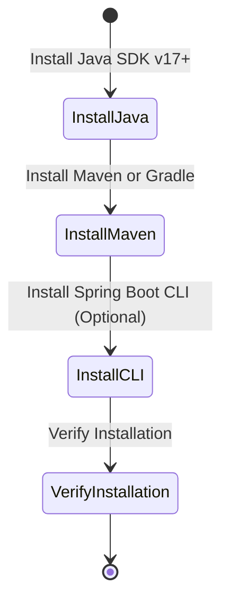

# **Installing Spring Boot and Setting Up Development Tools**

## Objectives of the Lab

- **Install** and configure the necessary tools to begin Spring Boot development.
- **Understand** the different installation methods for Spring Boot and related tools such as Maven, Gradle, and the Spring Boot CLI.
- **Experiment** with the Spring Boot CLI for quick prototyping.

**Importance within the Course Context:**

- Correct installation and setup of Spring Boot, Maven, Gradle, and the CLI are crucial for successful application development.
- Using a standardized build tool like Maven or Gradle streamlines project management and ensures consistency across development environments.

**Real-World Applications:**

- Developers often use build tools like Maven and Gradle to automate tasks like compiling, testing, and packaging Java applications.
- Spring Boot CLI can be used for rapid prototyping and testing ideas quickly without complex configurations.

## Key Concepts and Definitions

1. **Spring Boot**: A Java framework for building stand-alone, production-grade Spring-based applications with minimal configuration.
2. **Java SDK**: A software development kit required for developing Java applications, including tools for compiling and running Java programs.
3. **Maven**: A popular build automation tool used primarily for Java projects, which manages project dependencies and builds.
4. **Gradle**: A flexible build automation tool for Java projects that uses a Groovy or Kotlin DSL for configuration.
5. **Spring Boot CLI**: A command line interface for Spring Boot, enabling rapid prototyping and development without needing a full IDE setup.
6. **SDKMAN!**: A tool for managing parallel versions of software development kits, such as Java, Maven, and Spring Boot CLI.
7. **Homebrew**: A package manager for macOS that simplifies installing software.
8. **MacPorts**: A package management system for macOS used to install software.

**Significance:**

- Understanding the different installation methods allows developers to choose the right tools for their environment.
- Maven and Gradle are industry-standard tools for managing project dependencies and automating build processes.
- Spring Boot CLI offers an alternative way to quickly bootstrap Spring applications without complex setup.

## Step-by-Step Instructions

### Step 1: Verifying Java Installation

1. **Open a terminal** (or command prompt on Windows).
2. **Check if Java is installed** by running:

   ```bash
   java -version
   ```

3. **Ensure that Java SDK version 17 or higher is installed**. If not, download and install it from [Oracle's Java SDK page](https://www.oracle.com/java/technologies/javase-jdk17-downloads.html) or [AdoptOpenJDK](https://adoptopenjdk.net/).

### Step 2: Installing Spring Boot for Java Development

#### Maven Installation

1. **Install Maven** using your operating system’s package manager:
   - **macOS** (Homebrew):

     ```bash
     brew install maven
     ```

   - **Ubuntu**:

     ```bash
     sudo apt-get install maven
     ```

   - **Windows** (Chocolatey):

     ```bash
     choco install maven
     ```

2. **Verify Maven installation** by running:

   ```bash
   mvn -version
   ```

#### Gradle Installation

1. **Install Gradle** using your operating system’s package manager:
   - **macOS** (Homebrew):

     ```bash
     brew install gradle
     ```

   - **Ubuntu**:

     ```bash
     sudo apt-get install gradle
     ```

   - **Windows** (Chocolatey):

     ```bash
     choco install gradle
     ```

2. **Verify Gradle installation** by running:

   ```bash
   gradle -version
   ```

3. **Optionally, use the Gradle wrapper** for projects that require a specific Gradle version. In your project directory, run:

   ```bash
   gradle wrapper --gradle-version 7.6
   ```

### Step 3: Installing the Spring Boot CLI

#### Manual Installation

1. **Download the Spring Boot CLI** from the following links:
   - [spring-boot-cli-3.3.4-bin.zip](https://repo.spring.io/release/org/springframework/boot/spring-boot-cli/3.3.4/)
   - [spring-boot-cli-3.3.4-bin.tar.gz](https://repo.spring.io/release/org/springframework/boot/spring-boot-cli/3.3.4/)
2. **Unpack the archive** and navigate to the `bin/` directory.
3. **Run the Spring Boot CLI** by adding the `spring` script to your PATH, or directly use:

   ```bash
   ./spring --version
   ```

#### SDKMAN! Installation

1. **Install SDKMAN!** by running:

   ```bash
   curl -s "https://get.sdkman.io" | bash
   source "$HOME/.sdkman/bin/sdkman-init.sh"
   ```

2. **Install Spring Boot CLI**:

   ```bash
   sdk install springboot
   ```

3. **Verify installation**:

   ```bash
   spring --version
   ```

### Step 4: Alternative Installation Methods for macOS

#### Homebrew Installation (macOS)

1. **Install Spring Boot CLI** using Homebrew:

   ```bash
   brew tap spring-io/tap
   brew install spring-boot
   ```

2. **Verify the installation**:

   ```bash
   spring --version
   ```

#### MacPorts Installation (macOS)

1. **Install Spring Boot CLI** using MacPorts:

   ```bash
   sudo port install spring-boot-cli
   ```

2. **Verify the installation**:

   ```bash
   spring --version
   ```

### Step 5: Spring Boot CLI for Windows

#### Scoop Installation (Windows)

1. **Install Spring Boot CLI** using Scoop:

   ```bash
   scoop bucket add extras
   scoop install springboot
   ```

2. **Verify the installation**:

   ```bash
   spring --version
   ```

### Step 6: Enabling Command-Line Completion

1. **For Bash and Zsh shells** (macOS and Linux), the Spring Boot CLI includes command-line completion scripts.
2. **To enable command-line completion**:
   - **Bash**:

     ```bash
     source ~/.sdkman/candidates/springboot/current/shell-completion/bash/spring
     ```

   - **Zsh**:

     ```bash
     source ~/.sdkman/candidates/springboot/current/shell-completion/zsh/_spring
     ```

**Note:** On Debian-based systems, you can place the scripts in the system-wide completion directory for automatic loading.

## File and Project Structure

This lab primarily involves verifying and setting up the necessary tools for Spring Boot development. It does not involve creating any files in a project directory. The CLI or build tools like Maven or Gradle will be used for project creation in future labs.

## Execution and Testing Instructions

### Verifying the Installation

1. **To verify Java SDK installation**, run:

   ```bash
   java -version
   ```

2. **To verify Maven installation**, run:

   ```bash
   mvn -version
   ```

3. **To verify Gradle installation**, run:

   ```bash
   gradle -version
   ```

4. **To verify Spring Boot CLI installation**, run:

   ```bash
   spring --version
   ```

### Using Spring Boot CLI

1. **To create a new Spring Boot project using the CLI**, run:

   ```bash
   spring init --dependencies=web my-project
   ```

2. **To navigate into the project directory and run the project**, execute:

   ```bash
   cd my-project
   ./mvnw spring-boot:run
   ```

## State Diagram



## Conclusion

- **Tool Installation:** Successfully installed Java SDK, Maven, Gradle, and optionally, Spring Boot CLI for development.
- **Command-Line Proficiency:** Gained hands-on experience with installing and verifying tools through command-line instructions.
- **Ready for Development:** With all tools set up, you are ready to start building Spring Boot applications using Maven, Gradle, or Spring Boot CLI.
