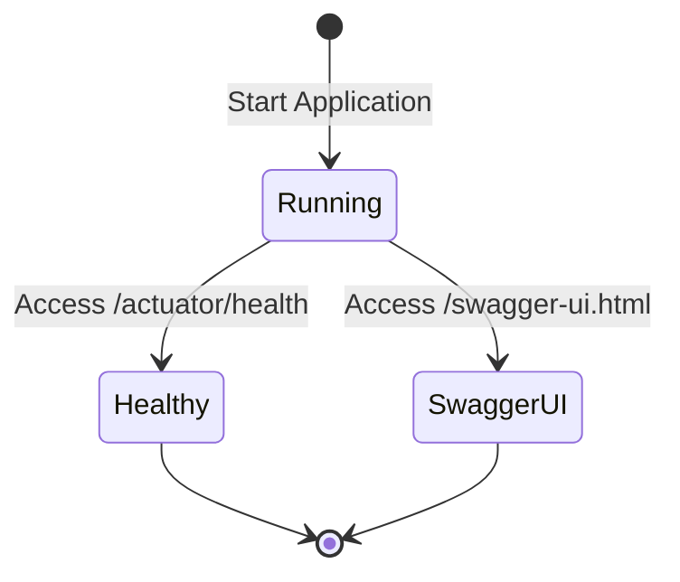

# **Creating a Stand-Alone Spring Boot Application Using Gradle Groovy (Version 3.3.4) with YAML Configuration and Swagger Integration**

## Objectives of the Lab

- **Setup** a stand-alone Spring Boot project using Gradle (Groovy DSL) with Spring Boot version 3.3.4.
- **Implement** a RESTful API with a basic endpoint following the MVC (Model-View-Controller) pattern.
- **Configure** health check capabilities using `application.yml`.
- **Integrate** Swagger using the latest SpringDoc version for API documentation and testing.

**Why These Objectives Are Important:**

- Mastery of modern Spring Boot and Gradle practices is essential for building production-grade applications.
- RESTful API development is crucial for creating scalable web services.
- Implementing health checks is necessary for monitoring and ensuring application reliability.
- Swagger integration using the latest version simplifies API documentation and testing.

**Real-World Applications:**

- Modern Spring Boot is widely adopted in enterprise applications for developing microservices and APIs.
- Health checks are essential in production environments for ensuring the application remains operational.
- The latest Swagger version enhances the developer experience by providing interactive documentation and testing.

## Key Concepts and Definitions

1. **Spring Boot**: A framework for building Java applications with minimal configuration and rapid development features.
2. **Gradle (Groovy DSL)**: A modern build automation tool used to manage dependencies, build, and test Java projects.
3. **YAML Configuration (`application.yml`)**: A simplified, human-readable configuration format used in Spring Boot.
4. **REST Controller**: A Spring component (`@RestController`) that handles HTTP requests and creates RESTful APIs.
5. **Embedded Server**: A server (like Tomcat) embedded into the Spring Boot application, removing the need for external server setups.
6. **Swagger**: A tool that automatically generates API documentation and provides an interface for testing endpoints.
7. **SpringDoc OpenAPI Starter**: The latest tool for integrating Swagger with Spring Boot, providing automatic API documentation and UI.

## Step-by-Step Instructions

### Step 1: Project Setup Using Spring Initializr

1. **Navigate to [Spring Initializr](https://start.spring.io/)**.
2. **Configure the project with the following settings:**
   - **Project**: Gradle - Groovy
   - **Language**: Java
   - **Spring Boot Version**: 3.3.4
   - **Group**: `com.example`
   - **Artifact**: `demo`
   - **Name**: `demo`
   - **Description**: `Demo project for Spring Boot`
   - **Package Name**: `com.example.demo`
   - **Packaging**: Jar
   - **Java Version**: 17
3. **Add the following dependencies:**
   - **Spring Web**
   - **Spring Boot DevTools**
   - **Spring Boot Actuator**
   - **SpringDoc OpenAPI Starter WebMVC UI** (for Swagger integration)
4. **Click Generate** to download the project. Unzip the downloaded file to your preferred working directory.

### Step 2: Import the Project into Your IDE

1. **Open IntelliJ IDEA or Eclipse**.
2. **Import the project as a Gradle Project** by selecting the project directory containing the `build.gradle` file.
3. **Verify the following directory structure:**

    ```
    demo/
    ├── build.gradle
    ├── settings.gradle
    ├── src/
    │   ├── main/
    │   │   ├── java/
    │   │   │   └── com/example/demo/
    │   │   │       ├── DemoApplication.java
    │   │   │       └── controller/
    │   │   │           └── HelloController.java
    │   │   └── resources/
    │   │       └── application.yml
    └── build/
    ```

### Step 3: Create a REST Controller Following the MVC Pattern

1. **In the `src/main/java/com/example/demo/controller/` directory, create a new file named `HelloController.java`.**
2. **Add the following code to `HelloController.java`:**

    ```java
    package com.example.demo.controller;

    import org.springframework.web.bind.annotation.GetMapping;
    import org.springframework.web.bind.annotation.RestController;

    @RestController
    public class HelloController {

        @GetMapping("/hello")
        public String hello() {
            return "Hello, Spring Boot!";
        }
    }
    ```

### Step 4: Configure Application Using `application.yml`

1. **In the `src/main/resources/` directory, locate or create `application.yml`.**
2. **Add the following content to `application.yml` to configure health endpoint exposure and Swagger settings:**

    ```yaml
    management:
      endpoints:
        web:
          exposure:
            include: health

    springdoc:
      api-docs:
        path: /v3/api-docs
      swagger-ui:
        path: /swagger-ui.html
    ```

### Step 5: Ensure Modern Dependencies in `build.gradle`

1. **Open `build.gradle` and ensure you use the latest modern dependencies. The file should look like this:**

    ```groovy
    plugins {
        id 'java'
        id 'org.springframework.boot' version '3.3.4'
        id 'io.spring.dependency-management' version '1.1.6'
    }

    group = 'com.example'
    version = '1.0.0'  // Stable version

    repositories {
        mavenCentral()
    }

    dependencies {
        implementation 'org.springframework.boot:spring-boot-starter-web'
        implementation 'org.springframework.boot:spring-boot-devtools'
        implementation 'org.springframework.boot:spring-boot-starter-actuator'
        implementation 'org.springdoc:springdoc-openapi-starter-webmvc-ui:2.6.0'  // Modern Swagger integration
        testImplementation 'org.springframework.boot:spring-boot-starter-test'
    }

    tasks.named('test') {
        useJUnitPlatform()
    }
    ```

2. **Refresh the Gradle project** to download the latest dependencies.

### Step 6: Run the Application

1. **Open a terminal in the project directory**.
2. **Run the following commands:**

    ```bash
    ./gradlew clean
    ./gradlew build
    ./gradlew bootRun
    ```

### Step 7: Test the Application

1. **Test the REST Endpoint:**
   - Open a web browser or Postman and navigate to `http://localhost:8080/hello`.
   - Expected response: `Hello, Spring Boot!`

2. **Test the Health Check Endpoint:**
   - Navigate to `http://localhost:8080/actuator/health`.
   - Expected response:

     ```json
     {
       "status": "UP"
     }
     ```

3. **Access Swagger UI for API Documentation:**
   - Navigate to `http://localhost:8080/swagger-ui.html`.
   - The Swagger UI should load, displaying the `/hello` endpoint. Test the endpoint through Swagger's UI by clicking "Try it out" and executing the request.

### Step 8: Build the Application as a JAR File

1. **To package the application into a JAR, run:**

    ```bash
    ./gradlew clean build
    ```

2. **Run the JAR file:**

    ```bash
    java -jar build/libs/demo-1.0.0.jar
    ```

## File and Project Structure

- **demo/build.gradle**: Gradle build script managing dependencies and build configurations.
- **demo/settings.gradle**: Gradle settings file specifying project details.
- **demo/src/main/java/com/example/demo/DemoApplication.java**: Entry point of the Spring Boot application.
- **demo/src/main/java/com/example/demo/controller/HelloController.java**: REST controller for handling the `/hello` endpoint.
- **demo/src/main/resources/application.yml**: YAML configuration file for managing Actuator and Swagger settings.
- **build/libs/demo-1.0.0.jar**: The final JAR file after building the project.

## Execution and Testing Instructions

- **Running the Project**:
  - Use `./gradlew bootRun` to run the application in development mode.
  - Use `java -jar build/libs/demo-1.0.0.jar` to run the JAR file.

- **Testing the API**:
  - Access `http://localhost:8080/hello` to test the REST endpoint.
  - Access `http://localhost:8080/actuator/health` to test the health check.
  - Access `http://localhost:8080/swagger-ui.html` to test the Swagger UI.

## State Diagram



## Conclusion

- **Modern Setup:** Successfully set up a Spring Boot application using the latest version of Spring Boot and modern dependencies like `springdoc-openapi-starter-webmvc-ui:2.6.0`.
- **REST API:** Implemented a REST API endpoint that follows the MVC pattern for better code organization.
- **Health Check:** Configured health check capabilities using `application.yml`.
- **Swagger Integration:** Integrated Swagger using modern dependencies for automatic API documentation and testing.
- **Deployment:** Packaged the application into a JAR file for deployment.

---
